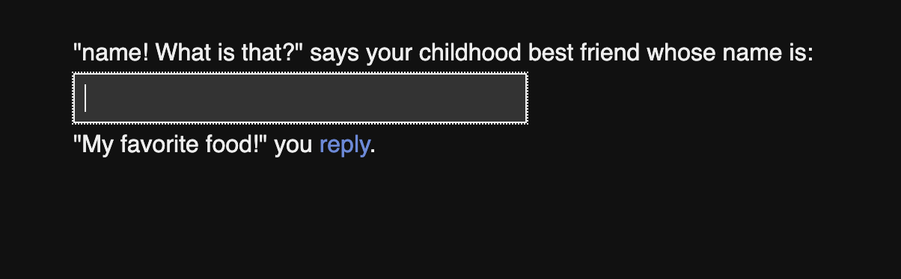
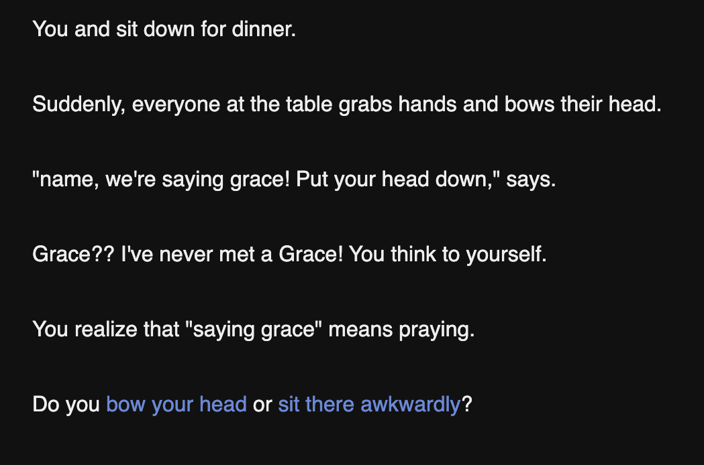

# About The Project

Interactive, non-linear fiction piece that describes assimilating as a first-generation American. While assimilation is a unique experience for every first-generation American, there are many common themes such as choosing what food to eat at school, what cultural traditions to display, and what clothes to wear.

# Built With

HTML & [Twine](https://twinery.org/)

# Usage
Interact with the story by adding characters as prompted and making personal decisions. 

# Contact
Isha Perry - ishaperry@gatech.edu

Project Link: https://github.com/IshaPerry/Cultural-Assimilation-Twine
